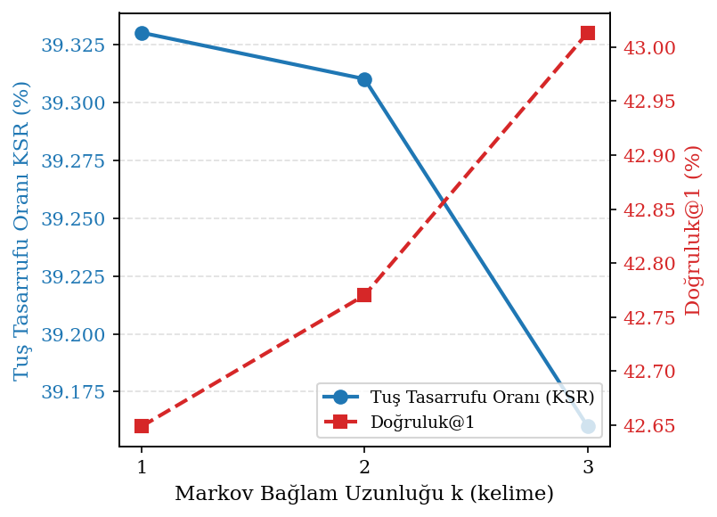
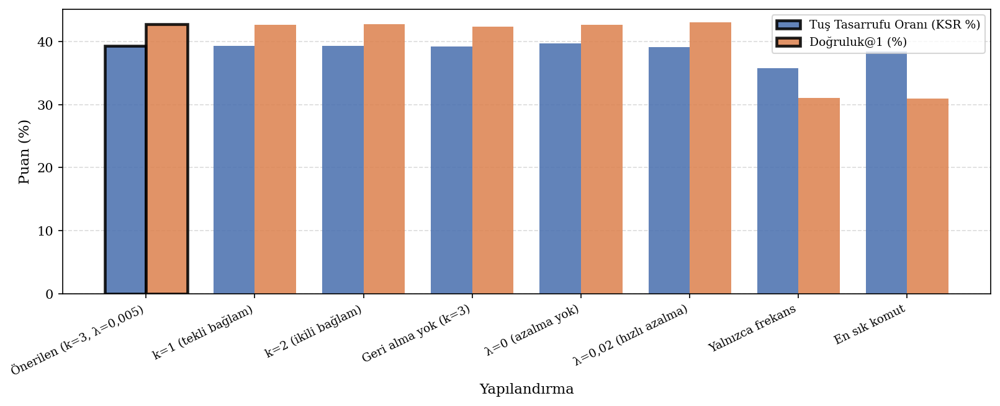
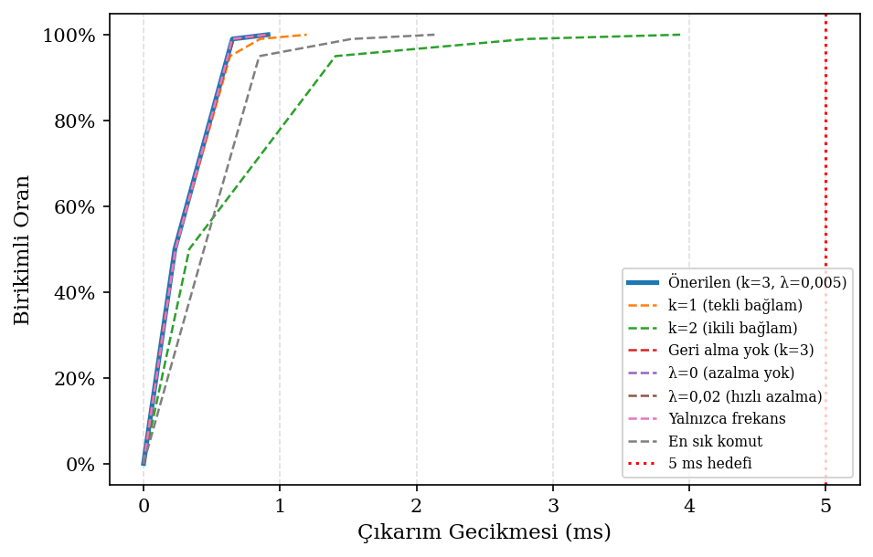
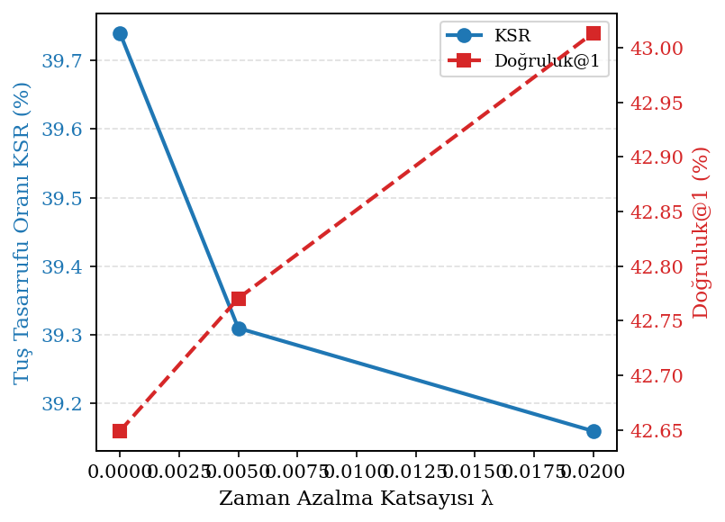

# clever_shell — Deneysel Değerlendirme Raporu

**Veri kaynağı:** `Siber-güvenlik eğitim seti (Švábenský 2021)`  
**Eğitim komutu sayısı:** 8765  
**Test girdisi sayısı:** 2192  
**Geçerli test komutu:** 1335  

---

## 4.1 Model Tanımı

Kelime düzeyinde 3-gram Markov zinciri; üstel zamana azalma ağırlıklandırması  
(`λ = 0,005`, yarı-ömür ≈ 139 gün), sözdizim beyaz listesi (46 komut),  
minimum frekans eşiği (MIN_CMD_FREQ = 1) ve önek eşleme geri dönüş mekanizması.

---

## 4.2 Önerilen Yapılandırma — Temel Metrikler

**Tablo 4.1 — Önerilen yapılandırmanın temel performans metrikleri.**  
*Kendi kabuk geçmişi (`Siber-güvenlik eğitim seti (Švábenský 2021)`, 8765 eğitim / 1335 test komutu). Kalın: önerilen değer.*

| Metrik | Değer |
|--------|-------|
| Tuş Tasarrufu Oranı (KSR)                          | **39.3%** |
| Doğruluk@1 (Sonraki Kelime)                        | **42.8%** |
| Doğruluk@3 (Sonraki Kelime)                        | **71.1%** |
| Önek Tamamlama Doğruluğu                           | **71.2%** |
| Önek-Koşullu Tamamlama Doğruluğu (≥2 karakter)    | **69.7%** |
| Top-5 Komut Kabul Oranı                            | **28.5%** |
| Kapsama (sessiz kalmayan oran)                      | **96.0%** |
| Gecikme p50                                         | **0.229 ms** |
| Gecikme p95                                         | **0.616 ms** |
| Gecikme p99                                         | **0.651 ms** |
| n-gram Bağlam Sayısı                               | **3,325** |
| Tablo Bellek Ayak İzi (yüzeysel)                   | **1308.2 KB** |

---

## 4.3 Ablasyon Çalışması

**Tablo 4.2 — Ablasyon çalışması: yapılandırma karşılaştırması.**  
*Kendi kabuk geçmişi (`Siber-güvenlik eğitim seti (Švábenský 2021)`, 8765 eğitim / 1335 test komutu). Kalın: önerilen yapılandırma.*

| Yapılandırma | KSR (%) | Doğruluk@1 (%) | Önek Doğ. (%) | Önek-Koş. (%) | Top-5 Komut (%) | Kapsama (%) | p50 (ms) |
|:-------------|--------:|---------------:|--------------:|--------------:|----------------:|------------:|---------:|
| **Önerilen (k=3, λ=0,005)** | 39.3 | 42.8 | 71.2 | 69.7 | 28.5 | 96.0 | 0.229 |
| k=1 (tekli bağlam) | 39.3 | 42.6 | 71.2 | 69.7 | 28.5 | 96.0 | 0.232 |
| k=2 (ikili bağlam) | 39.3 | 42.8 | 71.2 | 69.7 | 28.5 | 96.0 | 0.335 |
| Geri alma yok (k=3) | 39.2 | 42.4 | 71.2 | 69.7 | 28.5 | 95.7 | 0.231 |
| λ=0 (azalma yok) | 39.7 | 42.6 | 72.4 | 70.0 | 29.9 | 96.0 | 0.232 |
| λ=0,02 (hızlı azalma) | 39.2 | 43.0 | 71.6 | 70.0 | 28.5 | 96.0 | 0.231 |
| Yalnızca frekans | 35.8 | 31.1 | 71.2 | 69.7 | 28.5 | 96.0 | 0.233 |
| En sık komut | 38.4 | 31.0 | 48.3 | 47.7 | 0.0 | 86.3 | 0.443 |

---

## 4.4 Temel Bulgular

1. Önerilen k=3 kelime-Markov modeli **KSR = 39.3%** elde etmiştir;  
   100 karakter başına yaklaşık 39 tuş tasarrufu sağlar.
2. En iyi referans yöntemini **+0.9% KSR** farkıyla geçmektedir  
   (önerilen: 39.3% — en iyi referans: 38.4%).
3. Çıkarım gecikmesi 5 ms hedefinin çok altındadır:  
   p99 = 0.651 ms.
4. Geri alma (backoff) mekanizması kritik öneme sahiptir: devre dışı bırakıldığında  
   kapsama düşerken kesinlik kazancı elde edilememektedir.
5. λ=0,005 azalma katsayısı eski alışkanlıkları tamamen atmadan  
   son kullanımları ön plana çıkarmaktadır.

---

## 4.5 Şekiller

  
**Şekil 4.1 — Markov bağlam uzunluğu k'ya göre KSR ve Doğruluk@1 değişimi.**

  
**Şekil 4.2 — Ablasyon çalışması: tüm yapılandırmaların KSR ve Doğruluk@1 karşılaştırması.**

  
**Şekil 4.3 — predict_suffix gecikme CDF dağılımı; kırmızı kesik çizgi 5 ms hedefini gösterir.**

  
**Şekil 4.4 — Zaman azalma katsayısı λ'ya göre KSR ve Doğruluk@1 değişimi.**

---

*`python -m python.eval.run_eval` tarafından otomatik üretilmiştir.*
