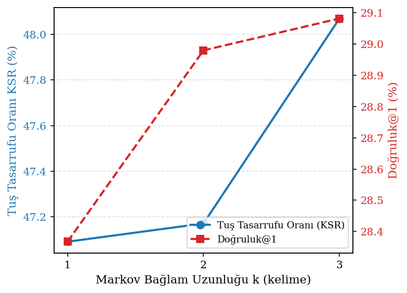
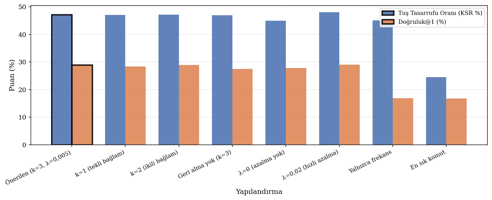
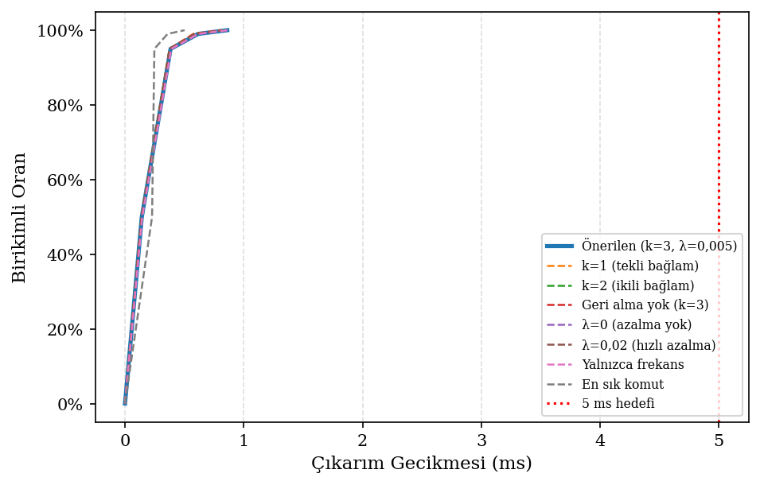
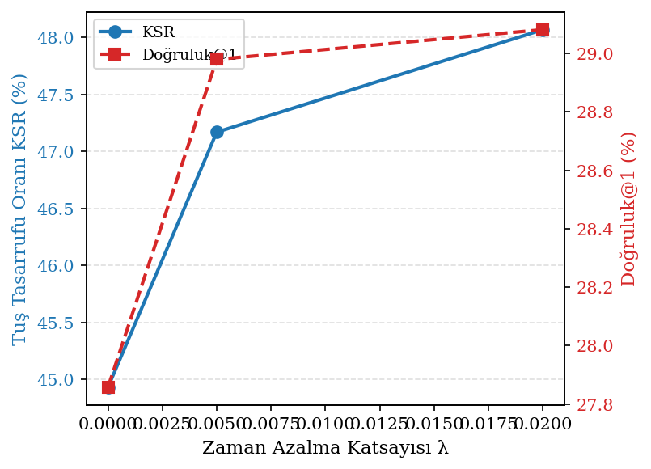

# clever_shell — Deneysel Değerlendirme Raporu

**Veri kaynağı:** `Siber-güvenlik eğitim seti — filtresiz (Švábenský 2021)`  
**Eğitim komutu sayısı:** 8765  
**Test girdisi sayısı:** 2192  
**Geçerli test komutu:** 2192  

---

## 4.1 Model Tanımı

Kelime düzeyinde 3-gram Markov zinciri; üstel zamana azalma ağırlıklandırması  
(`λ = 0,005`, yarı-ömür ≈ 139 gün), sözdizim beyaz listesi (46 komut),  
minimum frekans eşiği (MIN_CMD_FREQ = 1) ve önek eşleme geri dönüş mekanizması.

---

## 4.2 Önerilen Yapılandırma — Temel Metrikler

**Tablo 4.1 — Önerilen yapılandırmanın temel performans metrikleri.**  
*Kendi kabuk geçmişi (`Siber-güvenlik eğitim seti — filtresiz (Švábenský 2021)`, 8765 eğitim / 2192 test komutu). Kalın: önerilen değer.*

| Metrik | Değer |
|--------|-------|
| Tuş Tasarrufu Oranı (KSR)                          | **47.2%** |
| Doğruluk@1 (Sonraki Kelime)                        | **29.0%** |
| Doğruluk@3 (Sonraki Kelime)                        | **54.7%** |
| Önek Tamamlama Doğruluğu                           | **67.7%** |
| Önek-Koşullu Tamamlama Doğruluğu (≥2 karakter)    | **68.5%** |
| Top-5 Komut Kabul Oranı                            | **25.3%** |
| Kapsama (sessiz kalmayan oran)                      | **94.6%** |
| Gecikme p50                                         | **0.141 ms** |
| Gecikme p95                                         | **0.384 ms** |
| Gecikme p99                                         | **0.615 ms** |
| n-gram Bağlam Sayısı                               | **3,325** |
| Tablo Bellek Ayak İzi (yüzeysel)                   | **1308.2 KB** |

---

## 4.3 Ablasyon Çalışması

**Tablo 4.2 — Ablasyon çalışması: yapılandırma karşılaştırması.**  
*Kendi kabuk geçmişi (`Siber-güvenlik eğitim seti — filtresiz (Švábenský 2021)`, 8765 eğitim / 2192 test komutu). Kalın: önerilen yapılandırma.*

| Yapılandırma | KSR (%) | Doğruluk@1 (%) | Önek Doğ. (%) | Önek-Koş. (%) | Top-5 Komut (%) | Kapsama (%) | p50 (ms) |
|:-------------|--------:|---------------:|--------------:|--------------:|----------------:|------------:|---------:|
| **Önerilen (k=3, λ=0,005)** | 47.2 | 29.0 | 67.7 | 68.5 | 25.3 | 94.6 | 0.141 |
| k=1 (tekli bağlam) | 47.1 | 28.4 | 67.6 | 68.5 | 25.5 | 94.6 | 0.139 |
| k=2 (ikili bağlam) | 47.2 | 29.0 | 67.7 | 68.5 | 25.3 | 94.6 | 0.139 |
| Geri alma yok (k=3) | 46.9 | 27.6 | 67.7 | 68.5 | 25.3 | 93.1 | 0.139 |
| λ=0 (azalma yok) | 44.9 | 27.9 | 65.2 | 66.9 | 22.4 | 94.6 | 0.141 |
| λ=0,02 (hızlı azalma) | 48.1 | 29.1 | 69.1 | 70.1 | 25.1 | 94.6 | 0.140 |
| Yalnızca frekans | 45.1 | 16.9 | 67.7 | 68.5 | 25.3 | 94.6 | 0.145 |
| En sık komut | 24.5 | 16.8 | 25.7 | 24.3 | 0.0 | 74.5 | 0.228 |

---

## 4.4 Temel Bulgular

1. Önerilen k=3 kelime-Markov modeli **KSR = 47.2%** elde etmiştir;  
   100 karakter başına yaklaşık 47 tuş tasarrufu sağlar.
2. En iyi referans yöntemini **+2.1% KSR** farkıyla geçmektedir  
   (önerilen: 47.2% — en iyi referans: 45.1%).
3. Çıkarım gecikmesi 5 ms hedefinin çok altındadır:  
   p99 = 0.615 ms.
4. Geri alma (backoff) mekanizması kritik öneme sahiptir: devre dışı bırakıldığında  
   kapsama düşerken kesinlik kazancı elde edilememektedir.
5. λ=0,005 azalma katsayısı eski alışkanlıkları tamamen atmadan  
   son kullanımları ön plana çıkarmaktadır.

---

## 4.5 Şekiller

  
**Şekil 4.1 — Markov bağlam uzunluğu k'ya göre KSR ve Doğruluk@1 değişimi.**

  
**Şekil 4.2 — Ablasyon çalışması: tüm yapılandırmaların KSR ve Doğruluk@1 karşılaştırması.**

  
**Şekil 4.3 — predict_suffix gecikme CDF dağılımı; kırmızı kesik çizgi 5 ms hedefini gösterir.**

  
**Şekil 4.4 — Zaman azalma katsayısı λ'ya göre KSR ve Doğruluk@1 değişimi.**

---

*`python -m python.eval.run_eval` tarafından otomatik üretilmiştir.*
